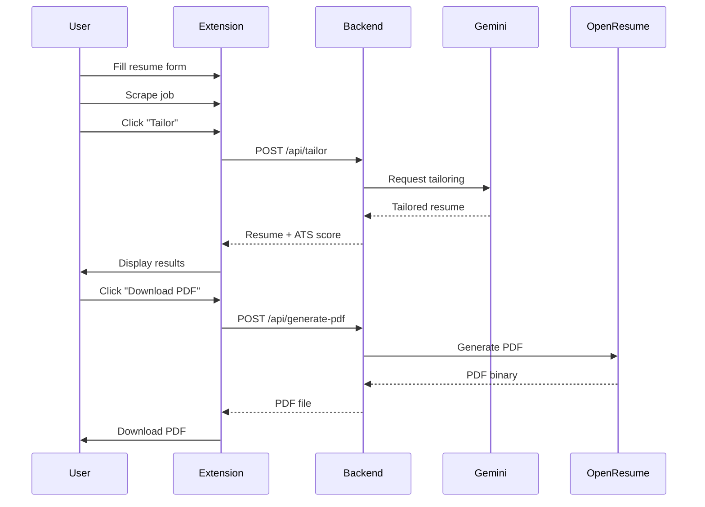

# Open Source Contribution Issues

This document contains detailed issue descriptions ready to be posted to GitHub Issues. Copy each section and create a new issue on GitHub.

---

## Issue #1: Add Informative Error Messages and User Feedback

**Labels**: `good first issue`, `enhancement`, `ui/ux`

### Description
The Chrome extension currently has generic error handling that could be more user-friendly and informative.

### Current Behavior
- Generic timeout messages
- No specific error codes for different failure types
- No guidance on what users should do when errors occur
- Missing differentiation between network errors, timeouts, and service failures

### Example Issue
```javascript
// extension/assets/js/api.js:52-53
console.error('Tailor request timeout after 60 seconds');
throw new Error('AI processing timed out...');
```

### Proposed Solution
1. Create an error message constants file
2. Add error type categorization (network, timeout, validation, service)
3. Include helpful troubleshooting steps in the UI
4. Show specific actions users can take to resolve errors

### Files to Modify
- `extension/assets/js/api.js`
- `extension/assets/js/storage.js`
- `extension/popup/popup.js`

### Acceptance Criteria
- [ ] Error messages are clear and actionable
- [ ] Different error types have distinct messages
- [ ] Users receive guidance on next steps
- [ ] Error UI is consistent across the extension

### Difficulty
**Beginner** - Good first issue for contributors learning about error handling and UX.

---

## Issue #2: Add Form Input Validation with Real-time Feedback

**Labels**: `good first issue`, `enhancement`, `ui/ux`

### Description
The resume form in the Chrome extension accepts user input without providing real-time validation feedback, which can lead to errors and poor user experience.

### Current Behavior
- No email format validation while typing
- No phone number format validation
- Empty required fields show no warning until submission
- No duplicate skill detection
- Date ranges not validated (start date could be after end date)

### Proposed Solution
1. Add inline validation for email format (regex: `^[^\s@]+@[^\s@]+\.[^\s@]+$`)
2. Add phone number format validation (international formats)
3. Highlight required fields that are empty
4. Show real-time validation feedback with helpful messages
5. Validate date ranges (start date <= end date, dates not in future for past jobs)
6. Detect and warn about duplicate skills

### Files to Modify
- `extension/popup/popup.js`
- `extension/popup/popup.html`
- `extension/assets/css/styles.css` (for validation styling)

### Acceptance Criteria
- [ ] Email validation works in real-time
- [ ] Phone number validation accepts international formats
- [ ] Required fields are clearly marked and validated
- [ ] Date range validation prevents logical errors
- [ ] Duplicate skills are detected and user is warned
- [ ] Validation messages are helpful and non-intrusive

### Difficulty
**Beginner** - Great for learning form validation and user feedback patterns.

### Reference
See lines 821-827 in `popup.js` for existing form handling logic.

---

## Issue #3: Add Code Comments to Job Scraper Logic

**Labels**: `good first issue`, `documentation`, `help wanted`

### Description
The job description scraper (`extension/content/scraper.js`) has complex DOM parsing logic with minimal inline comments, making it difficult for new contributors to understand and extend.

### Current Gaps
- Lines 59-100: Job site detection and routing logic lacks explanation
- Lines 200+: Organic scraping fallback mechanism is undocumented
- HTML selector mappings for each site lack context
- No explanation of why certain selectors are chosen
- Fallback strategy not clearly documented

### Proposed Solution
1. Add JSDoc comments to each scraping function
2. Document the job site detection algorithm
3. Explain the fallback strategy when primary selectors fail
4. Add inline comments for complex selector chains
5. Document how to add support for a new job site

### Example Improvement
```javascript
/**
 * Scrapes job description from LinkedIn job postings.
 *
 * Strategy:
 * 1. Try primary selector: .job-description
 * 2. Fallback to: .jobs-description__content
 * 3. Final fallback: organic text extraction
 *
 * @returns {string} Extracted job description text
 */
function scrapeLinkedIn() {
    // Implementation...
}
```

### Files to Modify
- `extension/content/scraper.js`

### Acceptance Criteria
- [ ] All scraping functions have JSDoc comments
- [ ] Complex logic has inline explanatory comments
- [ ] Selector choices are justified
- [ ] Fallback strategy is documented
- [ ] Instructions for adding new job sites are clear

### Difficulty
**Beginner** - Perfect for learning the codebase and documentation best practices.

---

## Issue #4: Replace TypeScript `any` Types with Proper Interfaces

**Labels**: `good first issue`, `code quality`, `typescript`

### Description
The PDF generation API uses `any` type in TypeScript, which defeats the purpose of type safety and can lead to runtime errors.

### Current Issue
```typescript
// open-resume-service/src/app/api/generate-pdf/route.ts:18
let body: any = null;  // Type safety issue
```

### Proposed Solution
1. Create proper TypeScript interfaces for the PDF request body
2. Replace all `any` types with specific types
3. Enable stricter TypeScript checking in `tsconfig.json`
4. Add type validation for incoming requests

### Example Implementation
```typescript
interface PDFGenerationRequest {
  resume: ResumeData;
  settings?: PDFSettings;
}

interface PDFSettings {
  fontFamily?: string;
  fontSize?: number;
  documentSize?: 'A4' | 'Letter' | 'Legal';
  themeColor?: string;
}

interface ResumeData {
  name: string;
  email: string;
  phone: string;
  summary?: string;
  experience: WorkExperience[];
  education: Education[];
  skills: string[];
}

// Replace:
let body: any = null;
// With:
let body: PDFGenerationRequest | null = null;
```

### Files to Modify
- `open-resume-service/src/app/api/generate-pdf/route.ts`
- `open-resume-service/tsconfig.json` (enable strict mode)
- Create `open-resume-service/src/types/resume.ts` for shared types

### Acceptance Criteria
- [ ] No `any` types in the PDF generation API
- [ ] Proper interfaces defined for all data structures
- [ ] TypeScript strict mode enabled
- [ ] Type errors caught at compile time
- [ ] Runtime type validation added

### Difficulty
**Beginner** - Good introduction to TypeScript and type safety.

---

## Issue #5: Add Configuration Validation Tests

**Labels**: `good first issue`, `testing`, `backend`

### Description
The backend configuration validation logic exists but lacks comprehensive tests, which could lead to undetected configuration errors in production.

### Current Gap
Config validation exists in `backend/src/app/config.py` but there's no dedicated test file to verify all edge cases and invalid configurations.

### Proposed Solution
Create `backend/tests/test_config.py` with comprehensive tests:

```python
import pytest
from pydantic import ValidationError
from app.config import Settings

def test_valid_configuration():
    """Test that valid configuration loads successfully"""
    pass

def test_invalid_cors_origins_format():
    """Test that malformed CORS origins are rejected"""
    pass

def test_missing_required_gemini_api_key():
    """Test that missing API key raises validation error"""
    pass

def test_temperature_out_of_range():
    """Test that temperature outside 0.0-1.0 is rejected"""
    # Temperature should be between 0.0 and 1.0
    pass

def test_invalid_gemini_model_name():
    """Test that invalid model names are rejected"""
    pass

def test_negative_timeout_values():
    """Test that negative timeouts are rejected"""
    pass

def test_invalid_log_level():
    """Test that invalid log levels use default"""
    pass

def test_max_resume_size_limits():
    """Test that resume size is properly limited"""
    pass
```

### Files to Create
- `backend/tests/test_config.py`

### Files to Reference
- `backend/src/app/config.py` - Configuration implementation

### Acceptance Criteria
- [ ] All configuration fields have validation tests
- [ ] Edge cases are covered (negative numbers, empty strings, etc.)
- [ ] Invalid configurations raise appropriate errors
- [ ] Tests pass with current configuration implementation
- [ ] Code coverage for config.py reaches 95%+

### Difficulty
**Beginner** - Great introduction to pytest and configuration testing.

---

## Issue #6: Implement Job Site Scraper for Monster.com

**Labels**: `enhancement`, `feature`, `help wanted`

### Description
The README mentions support for additional job sites (Monster, ZipRecruiter) as planned features. This issue focuses on adding Monster.com scraper.

### Current Support
- LinkedIn ✅
- Indeed ✅
- Greenhouse ✅
- Glassdoor ✅
- Ashby ✅

### Missing Support
- Monster.com
- ZipRecruiter
- Dice
- FlexJobs
- AngelList

### Implementation Steps

1. **Add Monster to supported sites**
```javascript
// extension/content/scraper.js:17
const PRIMARY_SOURCES = [
    'linkedin.com',
    'indeed.com',
    'greenhouse.io',
    'glassdoor.com',
    'jobs.ashbyhq.com',
    'monster.com'  // Add this
];
```

2. **Implement scraper function**
```javascript
function scrapeMonster() {
    const jobData = {
        title: '',
        company: '',
        description: ''
    };

    // Try primary selectors
    jobData.title = extractText('.job-title, h1.title');
    jobData.company = extractText('.company-name, .company');
    jobData.description = extractText('.job-description, .description');

    // Fallback to organic extraction if needed
    if (!jobData.description) {
        jobData.description = organicExtraction();
    }

    return jobData;
}
```

3. **Add routing logic**
```javascript
// extension/content/scraper.js:67-86
if (hostname.includes('monster.com')) {
    return scrapeMonster();
}
```

4. **Test on real Monster job postings**

### Files to Modify
- `extension/content/scraper.js`

### Acceptance Criteria
- [ ] Monster.com jobs can be scraped successfully
- [ ] Job title, company name, and description are extracted correctly
- [ ] Fallback mechanism works when primary selectors fail
- [ ] Code follows existing scraper patterns
- [ ] Tested on at least 5 different Monster job postings
- [ ] Documentation updated with Monster.com support

### Testing URLs
Provide at least 3 Monster.com job posting URLs that you tested with.

### Difficulty
**Intermediate** - Requires understanding of DOM parsing and testing across different page structures.

### Bonus
After Monster.com works, consider adding ZipRecruiter or Dice using the same pattern!

---

## Issue #7: Add Rate Limiting to Backend API

**Labels**: `enhancement`, `security`, `backend`

### Description
The backend API currently has no rate limiting protection, making it vulnerable to abuse from malicious actors or accidental API overuse.

### Current Risk
- API can be hammered with unlimited requests
- No protection against DDoS attacks
- Gemini API quota can be exhausted
- No circuit breaker for failing services

### Proposed Solution
Implement rate limiting using the `slowapi` library.

### Implementation

1. **Install dependency**
```bash
# Add to backend/requirements.txt
slowapi==0.1.9
```

2. **Configure rate limiter**
```python
# backend/src/app/main.py
from slowapi import Limiter, _rate_limit_exceeded_handler
from slowapi.util import get_remote_address
from slowapi.errors import RateLimitExceeded

limiter = Limiter(key_func=get_remote_address)
app.state.limiter = limiter
app.add_exception_handler(RateLimitExceeded, _rate_limit_exceeded_handler)
```

3. **Apply limits to endpoints**
```python
# backend/src/app/api/tailor.py
@router.post("/tailor")
@limiter.limit("5/minute")  # 5 tailor requests per minute per IP
async def tailor_resume(request: Request, data: TailorRequest):
    # Existing implementation
    pass

@router.post("/generate-pdf")
@limiter.limit("10/minute")  # 10 PDF generations per minute per IP
async def generate_pdf(request: Request, data: PDFRequest):
    # Existing implementation
    pass
```

4. **Add configuration**
```ini
# backend/.env
RATE_LIMIT_ENABLED=true
TAILOR_RATE_LIMIT=5/minute
PDF_RATE_LIMIT=10/minute
```

### Files to Modify
- `backend/requirements.txt`
- `backend/src/app/main.py`
- `backend/src/app/api/tailor.py`
- `backend/src/app/api/pdf.py`
- `backend/src/app/config.py` (add rate limit settings)
- `backend/.env.example` (document new settings)

### Acceptance Criteria
- [ ] Rate limiting is configurable via environment variables
- [ ] Endpoints have appropriate limits (consider API cost)
- [ ] Rate limit exceeded errors return clear HTTP 429 responses
- [ ] Rate limit headers are included in responses
- [ ] Tests verify rate limiting works correctly
- [ ] Documentation updated with rate limit information

### Testing
```python
# backend/tests/test_rate_limiting.py
def test_tailor_rate_limit_enforced():
    # Send 6 requests in quick succession
    # Expect 5 to succeed, 6th to return 429
    pass
```

### Difficulty
**Intermediate** - Requires understanding of middleware, HTTP status codes, and testing async APIs.

### Future Enhancement
Consider adding per-user API key rate limiting once authentication is implemented.

---

## Issue #8: Add Response Caching for Resume Tailoring

**Labels**: `enhancement`, `performance`, `backend`

### Description
Each resume-job description combination currently hits the Gemini API even if the exact same request has been made before, wasting API quota and increasing response time.

### Problem
- Identical resume + job description = redundant AI calls
- No caching mechanism
- Higher costs and slower responses
- Gemini API quota consumed unnecessarily

### Proposed Solution
Implement LRU (Least Recently Used) cache with hash-based key generation.

### Implementation

1. **Create cache key generator**
```python
# backend/src/services/gemini.py
import hashlib
from functools import lru_cache

def _generate_cache_key(resume_dict: dict, job_description: str) -> str:
    """Generate unique cache key from resume and job description"""
    resume_str = str(sorted(resume_dict.items()))
    resume_hash = hashlib.md5(resume_str.encode()).hexdigest()
    job_hash = hashlib.md5(job_description.encode()).hexdigest()
    return f"tailor:{resume_hash}:{job_hash}"
```

2. **Implement caching layer**
```python
# Option 1: In-memory cache (simple)
from cachetools import TTLCache

cache = TTLCache(maxsize=100, ttl=3600)  # 100 items, 1 hour TTL

def get_cached_tailoring(cache_key: str):
    return cache.get(cache_key)

def set_cached_tailoring(cache_key: str, result: dict):
    cache[cache_key] = result

# Option 2: Redis cache (production-ready)
# Requires redis setup - see future enhancement
```

3. **Apply caching to tailor method**
```python
async def tailor_resume(self, resume: Resume, job_description: str):
    # Generate cache key
    cache_key = _generate_cache_key(
        resume.dict(),
        job_description
    )

    # Check cache
    cached_result = get_cached_tailoring(cache_key)
    if cached_result:
        logger.info(f"Cache hit for key: {cache_key}")
        return cached_result

    # Cache miss - call Gemini
    logger.info(f"Cache miss for key: {cache_key}")
    result = await self._call_gemini_api(resume, job_description)

    # Store in cache
    set_cached_tailoring(cache_key, result)

    return result
```

### Configuration
```ini
# backend/.env
CACHE_ENABLED=true
CACHE_TTL=3600  # 1 hour
CACHE_MAX_SIZE=100  # Number of cached responses
```

### Files to Modify
- `backend/src/services/gemini.py`
- `backend/src/app/config.py` (add cache settings)
- `backend/requirements.txt` (add cachetools or redis)
- `backend/.env.example`

### Acceptance Criteria
- [ ] Cache key generation is deterministic
- [ ] Identical requests return cached results
- [ ] Cache has TTL to prevent stale data
- [ ] Cache statistics logged (hits/misses)
- [ ] Cache can be disabled via config
- [ ] Tests verify caching behavior
- [ ] Documentation includes cache explanation

### Testing
```python
def test_cache_hit_for_identical_requests():
    # Make same request twice
    # Second request should be faster and not call Gemini
    pass

def test_cache_miss_for_different_jobs():
    # Same resume, different job descriptions
    # Should result in different cache keys
    pass
```

### Difficulty
**Intermediate** - Requires understanding of caching strategies and hash functions.

### Future Enhancement
- Redis integration for distributed caching
- Cache warming for popular job descriptions
- Cache invalidation API endpoint

---

## Issue #9: Add Cover Letter Generation Feature

**Labels**: `enhancement`, `feature`, `ai`, `help wanted`

### Description
The roadmap mentions cover letter generation as a planned feature. This would use Gemini AI to create personalized cover letters based on the resume and job description.

### Proposed Feature
Generate customized cover letters that:
- Address the hiring manager
- Reference specific job requirements
- Highlight relevant experience from resume
- Match company tone and culture
- Maintain professional formatting

### Implementation Steps

1. **Create cover letter prompt template**
```python
# backend/src/prompts/cover_letter.py

COVER_LETTER_PROMPT = """
You are a professional cover letter writer. Generate a compelling cover letter based on:

Resume Summary:
{resume_summary}

Key Experience:
{key_experience}

Job Description:
{job_description}

Company: {company_name}
Position: {position_title}

Requirements:
1. Address it to the hiring manager
2. 3-4 paragraphs maximum
3. Highlight 2-3 most relevant experiences
4. Show enthusiasm for the role
5. Professional but warm tone
6. Include call to action
7. Proper business letter format

Generate the cover letter now:
"""
```

2. **Add Pydantic model**
```python
# backend/src/models/resume.py

class CoverLetterRequest(BaseModel):
    resume: Resume
    job_description: str
    company_name: str
    position_title: str
    hiring_manager_name: Optional[str] = "Hiring Manager"
    tone: Literal["professional", "warm", "enthusiastic"] = "professional"

class CoverLetterResponse(BaseModel):
    cover_letter: str
    word_count: int
    key_points_highlighted: List[str]
```

3. **Create API endpoint**
```python
# backend/src/app/api/cover_letter.py

from fastapi import APIRouter, HTTPException
from models.resume import CoverLetterRequest, CoverLetterResponse
from services.gemini import GeminiService

router = APIRouter()

@router.post("/generate-cover-letter", response_model=CoverLetterResponse)
async def generate_cover_letter(request: CoverLetterRequest):
    try:
        gemini = GeminiService()
        cover_letter = await gemini.generate_cover_letter(
            resume=request.resume,
            job_description=request.job_description,
            company_name=request.company_name,
            position_title=request.position_title,
            tone=request.tone
        )

        return CoverLetterResponse(
            cover_letter=cover_letter,
            word_count=len(cover_letter.split()),
            key_points_highlighted=extract_key_points(cover_letter)
        )
    except Exception as e:
        raise HTTPException(status_code=500, detail=str(e))
```

4. **Add to Gemini service**
```python
# backend/src/services/gemini.py

async def generate_cover_letter(
    self,
    resume: Resume,
    job_description: str,
    company_name: str,
    position_title: str,
    tone: str = "professional"
) -> str:
    # Implementation using Gemini API
    pass
```

5. **Update extension UI**
```html
<!-- extension/popup/popup.html -->
<button id="generateCoverLetterBtn">Generate Cover Letter</button>
<textarea id="coverLetterOutput" readonly></textarea>
```

### Files to Create
- `backend/src/prompts/cover_letter.py`
- `backend/src/app/api/cover_letter.py`
- `backend/tests/test_cover_letter.py`

### Files to Modify
- `backend/src/models/resume.py`
- `backend/src/services/gemini.py`
- `backend/src/app/main.py` (register router)
- `extension/popup/popup.html`
- `extension/popup/popup.js`
- `extension/assets/js/api.js`

### Acceptance Criteria
- [ ] Cover letters are personalized to job description
- [ ] Generated letters are 250-400 words
- [ ] Professional business letter format
- [ ] Key resume experiences are highlighted
- [ ] Tone can be customized
- [ ] Generated letter can be copied/downloaded
- [ ] Tests verify generation works
- [ ] API documentation updated

### Difficulty
**Intermediate** - Requires understanding of prompt engineering and AI integration.

### Future Enhancements
- Multiple cover letter styles
- Company research integration
- A/B testing different versions
- Cover letter scoring

---

## Issue #10: Add Comprehensive Integration Tests for Chrome Extension

**Labels**: `testing`, `extension`, `help wanted`

### Description
The backend has ~90% test coverage, but the Chrome extension has no automated tests. This makes it risky to refactor or add features.

### Current Gap
- No automated tests for extension
- Manual testing only
- Risk of regressions when adding features
- No CI/CD for extension

### Proposed Solution
Set up Jest or Playwright for extension testing.

### Implementation

1. **Install testing framework**
```bash
# extension/package.json
{
  "devDependencies": {
    "jest": "^29.0.0",
    "@testing-library/dom": "^9.0.0",
    "jest-chrome": "^0.8.0"
  },
  "scripts": {
    "test": "jest",
    "test:watch": "jest --watch",
    "test:coverage": "jest --coverage"
  }
}
```

2. **Create test files**
```javascript
// extension/tests/popup.test.js
describe('Resume Form', () => {
    test('should save resume with all required fields', () => {
        // Fill form with valid data
        // Submit form
        // Verify data saved to chrome.storage
    });

    test('should validate email format', () => {
        // Enter invalid email
        // Expect validation error
    });

    test('should prevent submitting empty form', () => {
        // Try submitting without filling fields
        // Expect error message
    });
});

// extension/tests/scraper.test.js
describe('Job Scraper', () => {
    test('should detect LinkedIn job postings', () => {
        // Mock LinkedIn page DOM
        // Call scraper
        // Verify job data extracted
    });

    test('should fallback to manual input on unsupported sites', () => {
        // Mock unsupported site
        // Expect manual input option shown
    });
});

// extension/tests/storage.test.js
describe('Storage Management', () => {
    test('should normalize resume data correctly', () => {
        // Input: raw resume data
        // Output: normalized data matching backend schema
    });

    test('should handle skill normalization', () => {
        // Various skill formats
        // Expect consistent output
    });
});

// extension/tests/api.test.js
describe('API Client', () => {
    test('should handle successful tailor response', async () => {
        // Mock successful API response
        // Verify parsed correctly
    });

    test('should retry on timeout', async () => {
        // Mock timeout
        // Verify retry attempted
    });

    test('should handle network errors gracefully', async () => {
        // Mock network failure
        // Verify error handling
    });
});
```

3. **Mock Chrome APIs**
```javascript
// extension/tests/__mocks__/chrome.js
global.chrome = {
    storage: {
        local: {
            get: jest.fn(),
            set: jest.fn(),
            remove: jest.fn()
        }
    },
    runtime: {
        sendMessage: jest.fn()
    }
};
```

### Files to Create
- `extension/tests/popup.test.js`
- `extension/tests/scraper.test.js`
- `extension/tests/storage.test.js`
- `extension/tests/api.test.js`
- `extension/tests/__mocks__/chrome.js`
- `extension/jest.config.js`

### Files to Modify
- `extension/package.json`
- `.github/workflows/test.yml` (add extension tests to CI)

### Acceptance Criteria
- [ ] All major extension features have tests
- [ ] Chrome API calls are properly mocked
- [ ] Tests pass consistently
- [ ] Code coverage > 80%
- [ ] Tests run in CI/CD pipeline
- [ ] Test documentation provided

### Difficulty
**Intermediate** - Requires understanding of Jest, mocking, and Chrome extension APIs.

### Resources
- [Jest Documentation](https://jestjs.io/)
- [jest-chrome](https://github.com/extend-chrome/jest-chrome)
- [Testing Library](https://testing-library.com/)

---

## Issue #11: Create Architecture Diagram and Documentation

**Labels**: `documentation`, `good first issue`

### Description
The README provides comprehensive information but lacks visual architecture diagrams that would help new contributors quickly understand the system design.

### Missing Documentation
- High-level architecture diagram
- Data flow diagrams (resume → tailor → PDF)
- API sequence diagrams
- Component interaction diagrams
- Extension message passing flow

### Proposed Diagrams

1. **System Architecture Diagram**
```
┌─────────────────────────────────────────────────────┐
│                 User Browser                         │
│  ┌──────────────────────────────────────────────┐  │
│  │         Chrome Extension                      │  │
│  │  ┌──────────┐  ┌──────────┐  ┌───────────┐  │  │
│  │  │  Popup   │  │ Content  │  │Background │  │  │
│  │  │    UI    │  │ Scraper  │  │  Worker   │  │  │
│  │  └─────┬────┘  └────┬─────┘  └─────┬─────┘  │  │
│  └────────┼────────────┼──────────────┼────────┘  │
└───────────┼────────────┼──────────────┼───────────┘
            │            │              │
            ▼            ▼              ▼
    ┌───────────────────────────────────────┐
    │        FastAPI Backend (Port 8000)     │
    │  ┌──────────┐  ┌────────────────────┐│
    │  │  Health  │  │  Tailor  │  PDF    ││
    │  │  Check   │  │  API     │  API    ││
    │  └──────────┘  └────┬───────────┬───┘│
    └──────────────────────┼───────────┼────┘
                           │           │
                ┌──────────▼─────┐    │
                │  Gemini AI     │    │
                │  Service       │    │
                └────────────────┘    │
                                      │
                           ┌──────────▼─────────┐
                           │  Open Resume       │
                           │  PDF Service       │
                           │  (Next.js:3000)    │
                           └────────────────────┘
```

2. **Resume Tailoring Flow**
```
User → Extension → API → Gemini → Response → Extension → User
  1. Fill resume form
  2. Scrape job description
  3. POST /api/tailor
  4. AI processing
  5. Return tailored resume + ATS score
  6. Display results
```

3. **PDF Generation Flow**
```
Extension → Backend → Open Resume → PDF
  1. Click "Download PDF"
  2. POST /api/generate-pdf
  3. Transform data to Open Resume format
  4. Render PDF with React
  5. Return PDF binary
  6. Download to user's computer
```

### Proposed Files
```
docs/
├── ARCHITECTURE.md          # System architecture overview
├── DATA_FLOW.md            # Data flow diagrams
├── EXTENSION_DEV.md        # Extension development guide
├── API_SEQUENCE.md         # API call sequences
└── diagrams/
    ├── architecture.svg
    ├── data-flow.svg
    ├── extension-flow.svg
    └── pdf-generation.svg
```

### Tools for Diagrams
- [Mermaid](https://mermaid.js.org/) - Markdown-based diagrams
- [Draw.io](https://draw.io/) - Visual diagram editor
- [PlantUML](https://plantuml.com/) - UML diagrams from text

### Example Mermaid Diagram


### Files to Create
- `docs/ARCHITECTURE.md`
- `docs/DATA_FLOW.md`
- `docs/EXTENSION_DEVELOPMENT.md`
- `docs/diagrams/` (directory)

### Files to Modify
- `README.md` (link to new docs)

### Acceptance Criteria
- [ ] Architecture diagram clearly shows all components
- [ ] Data flow diagrams show request/response patterns
- [ ] Diagrams are version-controlled (SVG or mermaid)
- [ ] Documentation explains each component's role
- [ ] Diagrams are referenced in README
- [ ] New contributors can understand system in <30 minutes

### Difficulty
**Beginner-Intermediate** - Requires understanding the system but diagrams are straightforward.

---

## Issue #12: Add Rate Limiting Tests and Monitoring

**Labels**: `testing`, `backend`, `monitoring`

### Description
Once rate limiting is implemented (see Issue #7), we need comprehensive tests and monitoring to ensure it works correctly.

### Proposed Tests

```python
# backend/tests/test_rate_limiting.py
import pytest
import asyncio
from httpx import AsyncClient

@pytest.mark.asyncio
async def test_tailor_endpoint_rate_limit():
    """Verify tailor endpoint enforces 5 requests/minute limit"""
    async with AsyncClient(app=app, base_url="http://test") as client:
        # Send 6 requests rapidly
        responses = []
        for i in range(6):
            response = await client.post("/api/tailor", json=valid_request)
            responses.append(response)

        # First 5 should succeed
        assert all(r.status_code == 200 for r in responses[:5])

        # 6th should be rate limited
        assert responses[5].status_code == 429
        assert "Rate limit exceeded" in responses[5].json()["detail"]

@pytest.mark.asyncio
async def test_rate_limit_headers_present():
    """Verify rate limit headers are included in response"""
    async with AsyncClient(app=app, base_url="http://test") as client:
        response = await client.post("/api/tailor", json=valid_request)

        assert "X-RateLimit-Limit" in response.headers
        assert "X-RateLimit-Remaining" in response.headers
        assert "X-RateLimit-Reset" in response.headers

@pytest.mark.asyncio
async def test_rate_limit_resets_after_window():
    """Verify rate limit resets after time window"""
    async with AsyncClient(app=app, base_url="http://test") as client:
        # Exhaust rate limit
        for _ in range(5):
            await client.post("/api/tailor", json=valid_request)

        # Next request should be rate limited
        response = await client.post("/api/tailor", json=valid_request)
        assert response.status_code == 429

        # Wait for window to reset (61 seconds for 1 minute window)
        await asyncio.sleep(61)

        # Should work again
        response = await client.post("/api/tailor", json=valid_request)
        assert response.status_code == 200

@pytest.mark.asyncio
async def test_different_ips_have_separate_limits():
    """Verify different IPs are rate limited independently"""
    # Mock different IP addresses
    # Each should have their own rate limit bucket
    pass

def test_rate_limit_configuration_validation():
    """Test that rate limit config is validated"""
    # Invalid rate limit format should raise error
    # Negative limits should raise error
    pass
```

### Monitoring Requirements

1. **Prometheus Metrics**
```python
# backend/src/app/main.py
from prometheus_client import Counter, Histogram

rate_limit_hits = Counter(
    'rate_limit_hits_total',
    'Total rate limit hits',
    ['endpoint']
)

rate_limit_remaining = Histogram(
    'rate_limit_remaining',
    'Remaining rate limit allowance',
    ['endpoint']
)
```

2. **Logging**
```python
# Log when rate limits are hit
logger.warning(
    f"Rate limit exceeded for IP {client_ip} on endpoint {endpoint}"
)
```

3. **Metrics Dashboard**
- Track rate limit hits by endpoint
- Monitor most rate-limited IPs
- Alert when rate limits are frequently hit

### Files to Create
- `backend/tests/test_rate_limiting.py`
- `backend/src/monitoring/metrics.py`

### Files to Modify
- `backend/src/app/main.py` (add metrics)
- `backend/src/app/api/tailor.py` (add logging)

### Acceptance Criteria
- [ ] All rate limiting scenarios are tested
- [ ] Tests verify rate limit headers
- [ ] Tests verify limit resets correctly
- [ ] Metrics track rate limit usage
- [ ] Alerts configured for abuse detection
- [ ] Documentation explains rate limits

### Difficulty
**Intermediate** - Requires async testing and metrics understanding.

---

## Summary Table

| Issue # | Title | Labels | Difficulty |
|---------|-------|--------|-----------|
| 1 | Add informative error messages | good first issue, ui/ux | Beginner |
| 2 | Add form input validation | good first issue, ui/ux | Beginner |
| 3 | Add code comments to scraper | good first issue, docs | Beginner |
| 4 | Replace TypeScript any types | good first issue, typescript | Beginner |
| 5 | Add configuration validation tests | good first issue, testing | Beginner |
| 6 | Implement Monster.com scraper | enhancement, feature | Intermediate |
| 7 | Add rate limiting to API | enhancement, security | Intermediate |
| 8 | Add response caching | enhancement, performance | Intermediate |
| 9 | Add cover letter generation | enhancement, feature, ai | Intermediate |
| 10 | Add extension integration tests | testing, extension | Intermediate |
| 11 | Create architecture diagrams | documentation | Beginner-Int |
| 12 | Add rate limiting tests | testing, monitoring | Intermediate |

---

## How to Use This Document

1. **For Repository Maintainers**:
   - Copy each issue into GitHub Issues
   - Add appropriate labels
   - Assign to milestones if desired

2. **For Contributors**:
   - Pick an issue matching your skill level
   - Comment on the issue to claim it
   - Follow the implementation guide
   - Submit a PR when ready

3. **For Quick Start**:
   - Beginners: Start with issues #1-5
   - Intermediate: Try issues #6-12
   - Want to help with docs: Issue #11

---

## Creating Issues on GitHub

To create these issues on GitHub:

1. Go to: https://github.com/Manishrdy/resume_tailoring_extension/issues/new
2. Copy the title and description from each issue above
3. Add the suggested labels
4. Click "Submit new issue"

Or use GitHub CLI (if installed):
```bash
gh issue create --title "Issue title" --body "Issue description" --label "label1,label2"
```

---

**Total Issues**: 12 comprehensive issues ready for open source contributions
**Difficulty Distribution**: 5 Beginner, 7 Intermediate
**Categories**: Code Quality (5), Features (3), Testing (3), Documentation (1)
